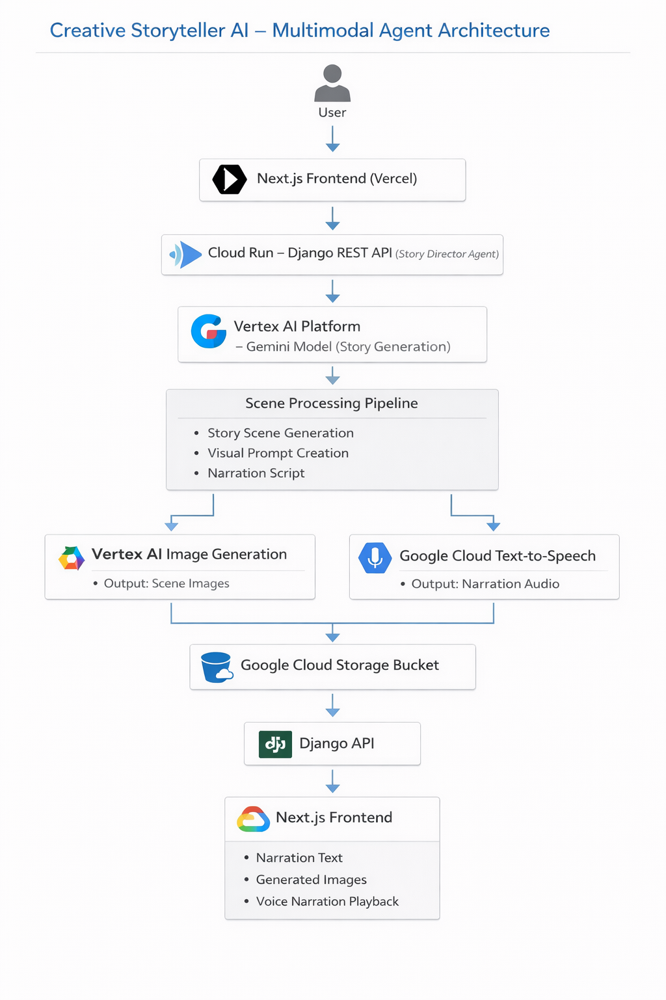
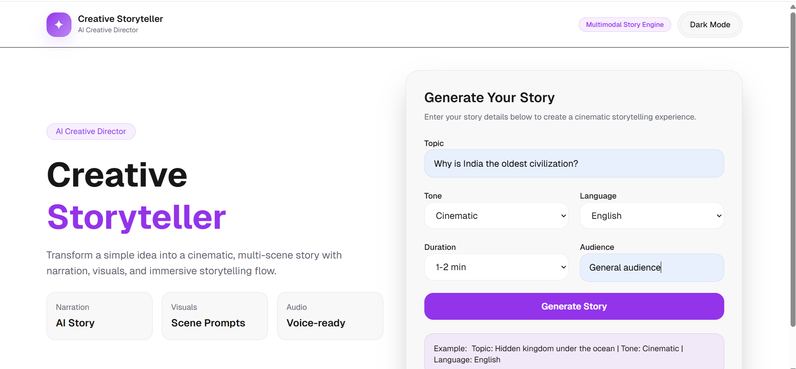
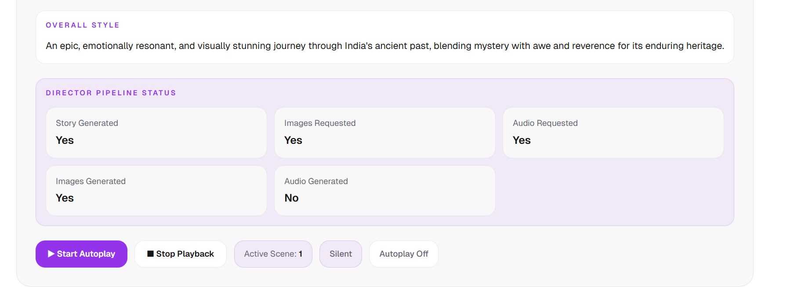
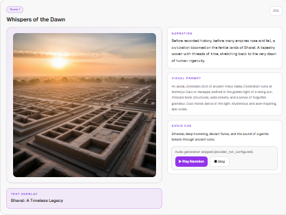
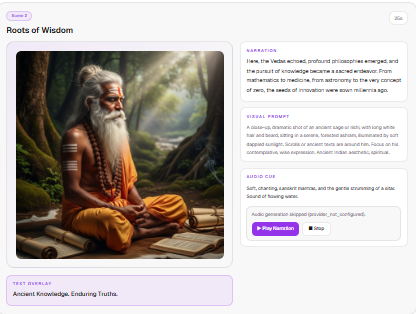
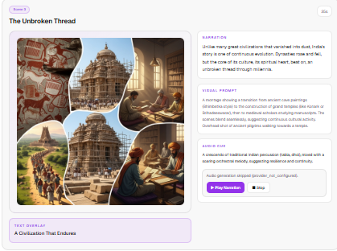
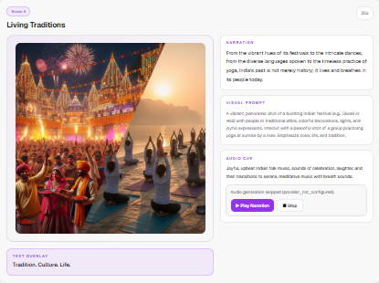
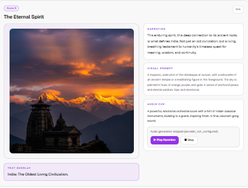

# Creative-Storyteller
Creative Storyteller

https://creative-storyteller-vercel1.vercel.app/

An AI-powered **multimodal storytelling agent** that transforms a simple idea into a cinematic story using **Gemini, AI-generated images, and voice narration**.

Creative Storyteller acts like an **AI Creative Director**, orchestrating text generation, visual imagery, and narration into a seamless storytelling experience.

---

# ✨ Features

- 🧠 **AI Story Generation** using Gemini
- 🎨 **AI Image Generation** for each story scene
- 🎙 **Voice Narration** using Google Cloud Text-to-Speech
- 📖 **Scene-based Story Structure**
- 🎥 **Automatic Story Playback**
- ☁️ **Cloud Storage** for generated media
- ⚡ **Scalable backend deployed on Google Cloud Run**

Users simply provide:

- Topic
- Tone
- Language
- Audience
- Duration

The system generates a **multi-scene cinematic story** with narration, visuals, and audio.

---

# 🧠 How It Works

1️⃣ User enters story parameters in the frontend  
2️⃣ Backend calls **Gemini API** to generate story scenes  
3️⃣ Each scene includes:
- narration text
- visual prompt
- audio cue

4️⃣ Images are generated using AI  
5️⃣ Narration audio is generated using **Google Text-to-Speech**  
6️⃣ Media assets are stored in **Google Cloud Storage**  
7️⃣ Frontend plays the story scene-by-scene

---

# 🏗 System Architecture



---

# 🛠 Tech Stack

### Frontend
- Next.js
- React
- TypeScript
- TailwindCSS

### Backend
- Python
- Django
- Django REST Framework

### AI & Cloud
- Gemini (Google GenAI SDK)
- Google Vertex AI
- Google Cloud Run
- Google Cloud Storage
- Google Cloud Text-to-Speech

### DevOps
- Docker
- Vercel

---


## ⚙️ Setup Guide

Follow the steps below to run **Creative Storyteller** locally.

---

## 1️⃣ Clone the Repository

```bash
git clone https://github.com/AnubhavBangari3/Creative-Storyteller.git
cd Creative-Storyteller
```

---

# Backend Setup (Django)

## 2️⃣ Create Virtual Environment

```bash
python -m venv venv
```

Activate environment:

**Windows**

```bash
venv\Scripts\activate
```

**Mac / Linux**

```bash
source venv/bin/activate
```

---

## 3️⃣ Install Backend Dependencies

```bash
pip install -r backend/requirements.txt
```

---

## 4️⃣ Configure Environment Variables

Create a `.env` file inside the **backend folder**.

Example:

```
# Gemini
GEMINI_API_KEY=
GEMINI_MODEL=

VERTEX_GEMINI_LOCATION=global

# Google Cloud
GCP_PROJECT_ID=
GCP_BUCKET_NAME=

# Image generation
VERTEX_IMAGE_ENABLED=true
VERTEX_IMAGE_MODEL=
VERTEX_IMAGE_LOCATION=

# Storage
USE_GCS_FOR_IMAGES=true
USE_GCS_FOR_AUDIO=true

# Text to Speech
TTS_PROVIDER=gcp
TTS_LANGUAGE_CODE=en-US
TTS_VOICE_NAME=en-US-Neural2-F
TTS_AUDIO_ENCODING=MP3
```

Make sure Google Cloud credentials are properly configured.

---

## 5️⃣ Run Django Backend

```bash
cd backend
python manage.py runserver
```

Backend will run at:

```
http://127.0.0.1:8000
```

---

# Frontend Setup (Next.js)

## 6️⃣ Install Frontend Dependencies

```bash
cd frontend
npm install
```

---

## 7️⃣ Configure Frontend Environment Variables

Create `.env.local` inside the **frontend folder**.

Example:

```
NEXT_PUBLIC_API_BASE_URL=http://127.0.0.1:8000
```

---

## 8️⃣ Run Frontend

```bash
npm run dev
```

Frontend will run at:

```
http://localhost:3000
```

---

# Cloud Deployment

The backend is deployed on **Google Cloud Run**, while media assets are stored in **Google Cloud Storage**.

---

# Project Workflow

1. User enters story parameters in the frontend.
2. Request is sent to the Django backend.
3. Gemini generates cinematic story scenes.
4. Image generation creates visuals for each scene.
5. Google Cloud Text-to-Speech generates narration audio.
6. Media assets are stored in Google Cloud Storage.
7. The frontend plays the story scene-by-scene.

---

# Notes

- Audio generation may be skipped if **Google Cloud Text-to-Speech quota is exceeded**.
- The system gracefully continues with **text + image storytelling**.

---

### Test the Application

1. Open the frontend in your browser.
2. Enter story parameters such as:

Example:

```
Topic: Why is India the oldest civilization?
Tone: Cinematic
Language: English
Audience: General
Duration: 1-2 Min

```



### Expected Output

The system will automatically:

- Generate a structured story using **Gemini**
- Create **scene-by-scene narration**
- Generate **AI images for each scene**
- Attempt to generate **voice narration using Google Cloud Text-to-Speech**
- Display the story sequentially in the frontend

---













